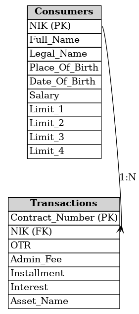

# PT XYZ Multifinance Scenario Test

## **Overview**
This is a Go-based backend application for paylater feature

## **Features**
- See credit limit
- Do transactional with credit limit
- Edit profile

## **Technologies Used**
- Go
- MySQL
- Swagger/OpenAPI for documentation
- Testify for unit testing

## **Setup Instructions**
1. Clone the repository:
   ```bash
   git clone https://gitlab.com/fabrianivan/xyz-multifinance.git
   ```
   or
   ```bash
   git clone https://github.com/fabrianivan-id/xyz-multifinance.git
   ```

## **Architecture of Application**


## **Database Structure**
